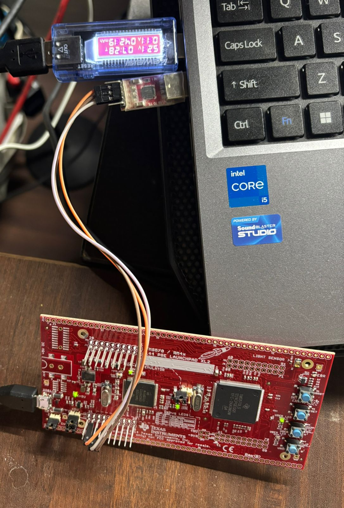

# Hardware Setup

The Flight Control Computer firmware has been validated on real hardware.

## Test Platform
- TI Hercules LaunchPad
- GPIO and UART drivers verified
- CCS + HALCoGen-based bring-up

## Hardware Snapshot

The setup is used to validate basic I/O, timing behavior, and system initialization
before higher-level flight logic integration.

